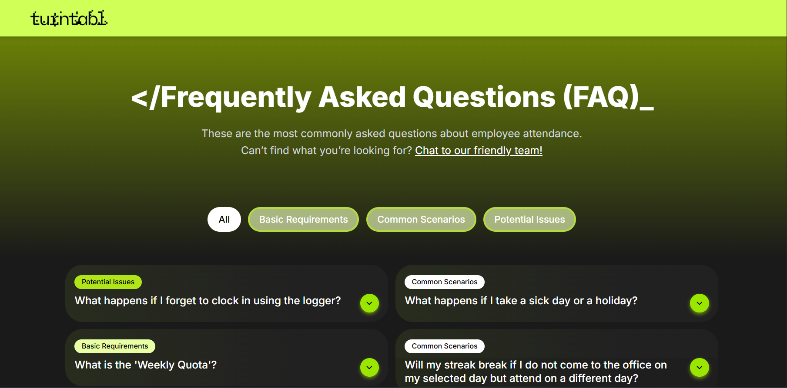
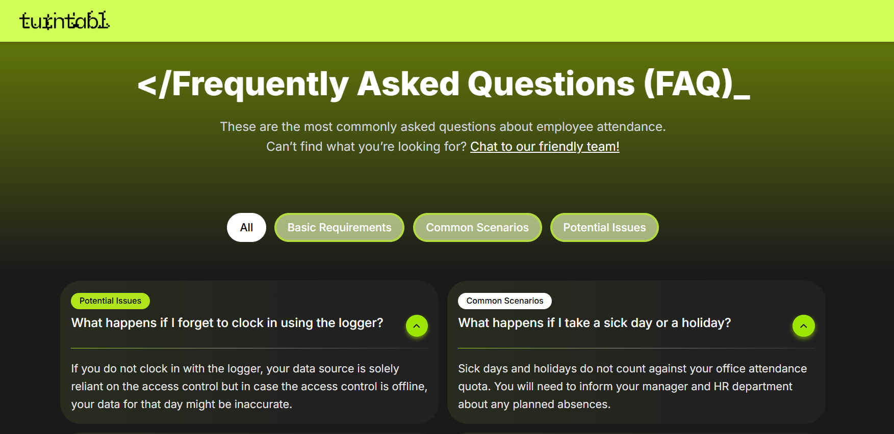
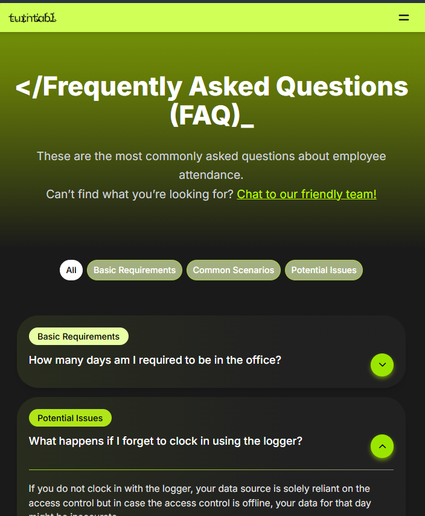

# Employee Attendance FAQ Page

<div align="center">


</div>

A Next.js application that creates a **responsive FAQ interface** with filtering capabilities and modern design. Built with TypeScript, Tailwind CSS, and featuring **smart category filtering**, **mobile-responsive design**, and **smooth animations**.



*Screenshot showing the FAQ application with filtering system and card layout on desktop*

If you're interested in seeing the design process and UI components, check out the [Figma design file](./figma%20UI/employee%20attendance%20FAQ_UI.png).

## Table of Contents

- [Features](#features)
- [Tech Stack](#tech-stack)
- [Getting Started](#getting-started)
- [Screenshots](#screenshots)
- [Development](#development)
- [Contributing](#contributing)

## Features

**Smart Filtering System**
- Category-based filtering with multiple selection options
- Dynamic content shuffling for enhanced user engagement
- Real-time filter updates with smooth transitions

**Modern UI/UX Design**
- Fully responsive layout optimized for all device sizes
- Custom gradient backgrounds and subtle glow effects

**Performance & Accessibility**
- Built with Next.js 14 for optimal performance
- TypeScript for type safety and better development experience
- Optimized font loading with Inter font family
- Mobile-first responsive design approach

## Tech Stack

- **Framework:** Next.js 14
- **Language:** TypeScript
- **Styling:** Tailwind CSS
- **State Management:** React Hooks (useState)
- **Font:** Inter font family

## Getting Started

### Prerequisites

Make sure you have Node.js (version 18+) installed on your system.

### Installation

1. **Clone the repository**
   ```bash
   git clone <your-repository-url>
   cd faq-application
   ```

2. **Install dependencies**
   ```bash
   npm install
   ```

3. **Start the development server**
   ```bash
   npm run dev
   ```

4. **Open your browser**
   
   Navigate to [nextjs-employee-faq-vercel-page](https://nextjs-employee-faq-git-main-inez-anne-marie-agbenus-projects.vercel.app?_vercel_share=PmAwFZiwW7kL6rrih0av7F10UnsUTl7e)

### Build for Production

```bash
npm run build
npm start
```

## Screenshots

### Desktop Interface

*Main FAQ interface with filtering sidebar and card grid*

### Mobile Experience

*Responsive mobile layout with burger menu navigation*

## Development

### Key Development Phases

**Project Foundation**
- Initial Next.js setup with TypeScript configuration
- Basic project structure and component architecture

**UI Development**
- Responsive navigation bar with mobile hamburger menu
- FAQ card system with grid layout

**Advanced Features**
- Dynamic filtering system with category selection
- Content shuffling functionality for improved UX
- Tailwind CSS styling with custom glow effects and animations

**Optimization & Polish**
- Mobile responsiveness improvements
- Performance optimizations and code cleanup
- Final styling touches and effect implementations

### Component Architecture

The application follows a modular, reusable component structure:

- **Separation of Concerns:** UI components isolated from business logic
- **Reusable Components:** Generic card and filter components for scalability
- **State Management:** Efficient React hooks implementation
- **Responsive Design:** Mobile-first development approach

## Deployment

### Vercel

1. Connect your GitHub repository to Vercel
2. Vercel will automatically detect Next.js and configure build settings
3. Deploy with automatic CI/CD on every push

## Contributing

Contributions are welcome! Here's how you can help:

1. Fork the repository
2. Create a feature branch (`git checkout -b feature/amazing-feature`)
3. Make your changes and test them
4. Commit your changes (`git commit -m 'Add amazing feature'`)
5. Push to your branch (`git push origin feature/amazing-feature`)
6. Open a Pull Request

## License

This project is licensed under the MIT License - see the [LICENSE](LICENSE) file for details.